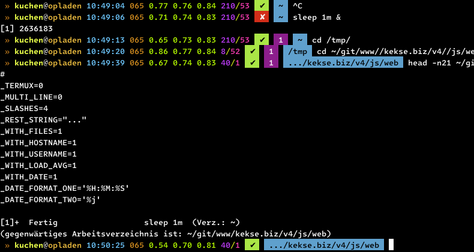
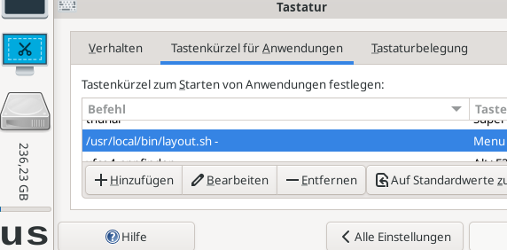

## Index
1. [News](#news)
2. [Bash](#bash)
	* [`prompt`.sh](#promptsh)
3. [JavaScript](#javascript)
4. [Copyright and License](#copyright-and-license)

## News
* \[**2024-02-18**\] Second new shell script [**`sync.sh`**](#syncsh)
* \[**2024-02-18**\] New bash shell script [**`unexify.sh`**](#unexifysh)
* \[**2024-02-14**\] Two new bash scripts (to handle file extensions)
* \[**2023-12-14**\] _New version **0.4.0**_ of [`clone.js`](#clonejs)
* \[**2023-12-26**\] Update in the [`junior.sh`](#juniorsh)

## [Bash](sh/)

### [`prompt`.sh](sh/prompt.sh)
Just copy this to `/etc/profile.d/prompt.sh`.. will change your `$PS1` prompt.
Uses the `$PROMPT_COMMAND` variable to dynamically change the prompt.

Version **1.1.0**.

#### Screenshot

### [`unexify`.sh](sh/unexify.sh)
Little helper script to recursively remove all headers from images.

The primary intention is to secure **all** images in your web root.
So e.g. when you take photos with your smartphone, they'll no longer
contain the GPS coordinates, etc. ;-)

Call with `-?` or `--help` to get to know a bit more.. the help text is encoded
in a variable on the file's top.

_JFYI_: Dependency is the [**`exiftool`**](https://exiftool.org), which is the
packet `libimage-exiftool-perl` within [**Debian** Linux](https://debian.org/).

### [`sync`.sh](sh/sync.sh)
Another helping hand which became required since I'm managing some archive on my server,
which needs to be synchronized with an (windows) USB stick.

> **Warning**
> PLEASE CHECK the **FIRST BOTH** configuration parts, relatively on top of the file..

### [`up2date`.sh](sh/up2date.sh)
Tool for [Gentoo](https://gentoo.org/) Linux, [Debian](https://debian.org/) and [Termux](https://termux.dev/) Linux.
I'm using it to do all steps to keep your packages `up2date`, in just one step!

Also, just copy it to `/etc/profile.d/up2date.sh`

### [`layout`.sh](sh/layout.sh)
The most important thing for me was to switch between keyboard layouts - easily with a shortcut I've set up in XFCE
(Settings -> Keyboard): calling this script with '-' argument only (so traversing, *not* setting..)!

Here's an example screenshot:

So either call it without arguments, so it'll show you the currently used layout. Call it with a concrete layout, to
switch to it directly. Or call it with a single `-`, so it'll traverse through the `layouts` array (on top, by default
it's `layouts=("us" "de")`).

### [`copy`.sh](sh/copy.sh)
A little helper to `scp` files, with only the remote file path as argument.

I'm using this to copy backups from my server, most because on errors this
is going to repeat the copy (as long you define in the 'loops' variable).
So just set your server {user,host,port} and copy securely.

BTW: yes, I had an unstable line when I created this.. via mobile phone.

### [`move-by-ext`.sh](sh/move-by-ext.sh)
Another tiny helper... really nothing special.

### [`find-ext`.sh](sh/find-ext.sh)
Something similar to the [`move-by-ext`.sh](#move-by-extsh) helper, but here without write operations,
only counting all different extensions available under the current working directory. And it's possible
to limit the `find` recursion depth via optional first argument (needs to be positive integer).

### [`make-nodejs`.sh](sh/make-nodejs.sh)
For **amd64** and **arm64** (Termux): a script to build a [Node.js](https://nodejs.org/) version that you define in
the command line, with target path `/opt/node.js/${version}/` plus a **symbolic link** `0` pointing to there.

So you can also manage multiple versions, or just check if the newest installation really works, before removing the
old one.. the only thing left to do, _just once_, is to merge the fs structure under the symlink path `/opt/node.js/0`
into the `/usr/` hierarchy.

I'm using this script on every new Node.js version, on my Linux desktop/workstation and on my Termux smartphone app;
therefore the `0` symlink will point to the newest version - and as you've merged everything _under it before_ (into
the `/usr` hierarchy), there's no need to change anything else. Just `rm -rf` the older version if the newest one
works! :)~

> **Note**
> Just call it via `make-nodejs.sh 20.4.0`, e.g.!

### [`junior`.sh](sh/junior.sh)
Since I'm using the [`llama.cpp`](https://github.com/ggerganov/llama.cpp/), or rather the
[`node-llama-cpp`](https://github.com/withcatai/node-llama-cpp), I just wrote a short
shell script to handle multiple models and prompts better.

Syntax: `$0 <model> <prompt> [ <context size> ]`.

### Snippets and one-liners
Really tiny helper scripts, or one-liner, cheats, etc..

#### [`chmod`.sh](sh/snippets/chmod.sh)
For recursive `chmod`, with different types for directories and files.

After this you'll see how many items were changed, and how many errors occured (if any), and how many files were
ignored (due to '$ignore' list; the one setting of two, together with '$hidden').

The erroneous files will be printed as list, so you can check them manually (otherwise just redirect the STDERR
by appending ` 2>/dev/null` to the cmdline).

#### [`count-all-lines`.sh](sh/snippets/count-all-lines.sh)
Define a glob and search for them (only _real_ files), then print their line counts (sorted, ascending),
plus the total count in the last line.

#### [`fresh`.sh](sh/snippets/fresh.sh)
One command to 'fresh up' the current git repository.. mentioned to be in `/etc/profile.d/`.

#### [`qemu`.sh](sh/snippets/qemu.sh)
Starting `qemu` with some most common, configurable parameters (as I like them).. really nothing special!

#### [`substring`.sh](sh/dunno/substring.sh)
Short overview over the string substitutions supported by the `bash`.. dug it out under my `~/git/knowledge/`,
so really not worth to mention here, but maybe a help if you need to write a shell script quickly (I don't
like it when using the `bash` but doing such things with external commands...).

## JavaScript
My favorite language.. ^\_^

### [`fold.css.js`](js/fold.css.js)
**Early version, so only the real basics are covered.**

'Folds' CSS style code. Earlier I used the `fold` (Linux) command, but that didn't work that well for what
I needed the resulting code: had to filter out CSS classes in `.html` code and `grep` for them in many
`.css` files - since `grep` is for lines, and `cut` is too stupid, .. I couldn't find the CSS styles in
stylesheets without newlines, etc. ..

>> *Warning*
>> A tiny but left in there.. /TODO/

### [`clone.js`](js/clone.js)
Just my own `Reflect.clone()` version, since JavaScript doesn't include it natively..

# Copyright and License
The Copyright is [(c) Sebastian Kucharczyk](./COPYRIGHT.txt),
and it's licensed under the [MIT](./LICENSE.txt) (also known as 'X' or 'X11' license).

