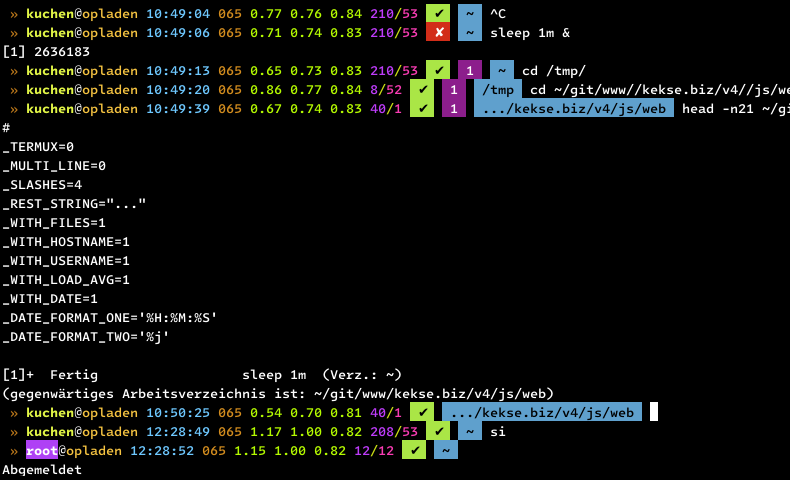

# **Scripts**
Every script is made by myself, arose out of necessity.. (most?) without any dependency.

## Index
1. [News](#news)
2. [Bash](#bash)
	* [`prompt`.sh](#promptsh)
	* [`unexify`.sh](#unexifysh)
	* [`sync`.sh](#syncsh)
	* [`ansi`.sh](#ansish)
	* [`up2date`.sh](#up2datesh)
	* [`layout`.sh](#layoutsh)
	* [`count-all-lines`.sh](#count-all-linessh)
	* [`copy`.sh](#copysh)
	* [`fresh`.sh](#freshsh)
	* [`replace`.sh](#replacesh)
	* [`toilets`.sh](#toiletssh)
	* [`math`.sh](#mathsh)
	* [`baseutils`.sh](#baseutilssh)
	* [`move-by-ext`.sh](#move-by-extsh)
	* [`find-ext`.sh](#find-extsh)
	* [`make-nodejs`.sh](#make-nodejssh)
	* [`router`.sh](#routersh)
	* [`hugging`.sh](#huggingsh)
	* [`convert-to-gguf`.sh](#convert-to-ggufsh)
	* [`nightlounge`.sh](#nightloungesh)
	* [`lsblk`.sh](#lsblksh)
3. [JavaScript](#javascript)
	* [`clone`.js](#clonejs)
	* [`links`.js](#linksjs)
	* [`reflection`.js](#reflectionjs)
	* [`intersection`.js](#intersectionjs)
	* [`multiset`.js](#multisetjs)
	* [`animation`.js](#animationjs)
	* [`fold.css`.js](#foldcssjs)
4. [C/C++](#cc)
    * [`nproc.c`](#nprocc)
5. [Copyright and License](#copyright-and-license)

## News
* \[**2024-05-08**\] New link to my [`animation`.js](#animationjs), from my [v4 project](https://github.com/kekse1/v4/);
* \[**2024-05-02**\] New [`lsblk`.sh](#lsblksh) shell script, **v0.2.0**;
* \[**2024-05-02**\] Updated [`links`.js](#linksjs) to **v0.8.3**.
* \[**2024-05-01**\] Updated [`convert-to-gguf`.sh](#convert-to-ggufsh) to **v0.0.5**
* \[**2024-04-30**\] New [`MultiSet`](#multisetjs) class, **v0.2.0**.
* \[**2024-04-30**\] New [`intersection`.js](#intersectionjs) for arrays, **v0.2.1** (for any data type);
* \[**2024-04-30**\] [`reflection`.js](#reflectionjs) updated to **v2.1.0**: **important update**!
* \[**2024-04-22**\] Updated [`hugging`.sh](#huggingsh) to **v0.2.4**..

## [Bash](sh/)

### [`prompt`.sh](sh/prompt.sh)
* [Version **v2.1.1**](sh/prompt.sh) (updated **2024-04-10**)

Just copy this to `/etc/profile.d/prompt.sh`.. will change your `$PS1` prompt.
Uses the `$PROMPT_COMMAND` variable to dynamically change the prompt.

Last update to **v2.1.1** is maybe important, since the **initial** deletion of `PS1`
let the `source` hang up (I think it could be caused by the `/etc/bash.bashrc`? maybe..).

#### Screenshot

### [`unexify`.sh](sh/unexify.sh)
* [Version **v0.1.2**](sh/unexify.sh) (updated **2024-04-23**)

Little helper script to recursively remove all headers from images.

The primary intention is to secure **all** images in your web root.
So e.g. when you take photos with your smartphone, they'll no longer
contain the GPS coordinates, etc. ;-)

Call with `-h` or `--help` to get to know a bit more.. the help text is encoded
in a variable on the file's top.

_JFYI_: Dependency is the [**`exiftool`**](https://exiftool.org), which is the
packet `libimage-exiftool-perl` within [**Debian** Linux](https://debian.org/).

### [`sync`.sh](sh/sync.sh)
* [Version **v0.4.4**](sh/sync.sh) (updated **2024-05-01**)

Another helping hand which became required since I'm managing some archive on my server,
which needs to be synchronized with an SB stick (using `crontab`, ..).

> [!WARNING]
> PLEASE CHECK the **FIRST BOTH** configuration parts, relatively on top of the file..

_BTW_: My target USB stick is formatted as `ExFAT` file system, so not all linux
file permissions and attributes are supported, and also no symbolic links. So I
decided to disable all these by default. If you want/need them, use the `-l` or
`--linux` cmdline argument. Additionally see `-d` or `--dereference`. **;-)**

> [!TOP]
> As usual, you can also use `-h` or `--help`! **:-D**

### [`ansi`.sh](sh/ansi.sh)
* [Version **v0.0.3**](sh/ansi.sh) (updated **2024-04-21**)

Starting with a shell script (to be `source`d) for ANSI escape sequences.

You either need to manually `source` or `.` in your shell (it's NOT executable),
or copy it to `/etc/profile.d/ansi.sh`.

### [`up2date`.sh](sh/up2date.sh)
* [Version **v0.2.1**](sh/up2date.sh)

Tool for [Gentoo](https://gentoo.org/) Linux, [Debian](https://debian.org/) and [Termux](https://termux.dev/) Linux.
I'm using it to do all steps to keep your packages `up2date`, in just one step!

Also, just copy it to `/etc/profile.d/up2date.sh`

### [`layout`.sh](sh/layout.sh)
* [Version **v0.2.0**](sh/layout.sh)

The most important thing for me was to switch between keyboard layouts - easily with a shortcut I've set up in XFCE
(Settings -> Keyboard): calling this script with '-' argument only (so traversing, *not* setting..)!

Here's an example screenshot:

So either call it without arguments, so it'll show you the currently used layout. Call it with a concrete layout, to
switch to it directly. Or call it with a single `-`, so it'll traverse through the `layouts` array (on top, by default
it's `layouts=("us" "de")`).

### [`count-all-lines`.sh](sh/count-all-lines.sh)
* [Version **v0.3.1**](sh/count-all-lines.sh) (updated **2024-02-25**)

Will traverse recursively through all sub directories (of current working directory) using one or more `find -iname`
parameters (especially globs to define file extensions!), and output a list of found ones with their line counts,
sorted ascending, and ending with the line count sum of all line counts.

### [`copy`.sh](sh/copy.sh)
* [Version **v0.1.2**](sh/copy.sh) (updated **2024-02-25**)

A little helper to `scp` files, with only the remote file path as argument.

I'm using this to copy backups from my server, most because on errors this
is going to repeat the copy (as long you define in the 'loops' variable).
So just set your server {user,host,port} and copy securely.

BTW: yes, I had an unstable line when I created this.. via mobile phone.

### [`fresh`.sh](sh/fresh.sh)
* [Version **v0.4.3**](sh/fresh.sh) (updated **2024-04-22**)

Helper to quickly update `git` repositories.. really tiny.

Now with check if you're inside a git repository, and also a commit message
is now required (because I was too lazy before..).

**Now** (**v0.3.0**) w/ new **`keep`** function (inter alia because `git`
won't see empty directories).

### [`replace`.sh](sh/replace.sh)
* [Version **v0.1.1**](sh/replace.sh) (created **2024-03-19**)

Recursive (really!) `sed` (regular expression) replacement in (only real!) files.

### [`toilets`.sh](sh/toilets.sh)
* [Version **v0.0.2**](sh/figlets.sh) (created **2024-03-19**)

Easily compare `toilet` (or `figlet`) outputs for a list of fonts in a file (each line another font).
Command line switches are passed through to the tool itself. Input texts can also be set via command
line, or just wait to get asked via `stdin`.

For many fonts see [this link](http://www.jave.de/figlet/fonts/overview.html); and here are the
websites of [`toilet`](http://caca.zoy.org/wiki/toilet) and [`figlet`](http://www.figlet.org/).

The font archive can be un-zipped in `/usr/share/figlet/` (even for `toilet`), or rather it's
`fonts/` directory itself.

### [`math`.sh](sh/math.sh)
* [Version **v0.2.2**](sh/math.sh) (updated **2024-04-17**)

Functions to be `source`d (so copy to `/etc/profile.d/`) providing conversions for size, and in
the future also some more math related functions.. for now, look at the source to get to know more.

You crender an amount of bytes to `GiB`, etc.. base 1024 and 1000 support,
and direct conversion to a specific target unit, or it'll automatically
detect which suites best:
* ` >> Syntax: bytes <value> [ <base=1024 | <unit> [ <prec=2> ] ]`

### [`baseutils`.sh](sh/baseutils.sh)
* [Version **v0.2.4**](sh/baseutils.sh) (updated **2024-04-24**)

This is just the beginning of more bash functions.

The project began with [`baseutils.org`](https://baseutils.org/), which was planned as regular
code (either C or JavaScript). Some first tools had been finished then.. they were planned for
my `Any/Linux` project (with still much, much TODO).. BUT I began to take over some old functions
from my `/etc/profile.d/` scripts, and now here we are..

Still _much_ **TODO**, but the first functions are declared and I'm going to implement everything soon!

### [`move-by-ext`.sh](sh/move-by-ext.sh)
* [Version **v0.0.2**](sh/move-by-ext.sh) (updated **2024-02-25**)

Another tiny helper... really nothing special.

### [`find-ext`.sh](sh/find-ext.sh)
* [Version **v0.1.2**](sh/find-ext.sh) (updated **2024-02-25**)

Something similar to the [`move-by-ext`.sh](#move-by-extsh) helper, but here without write operations,
only counting all different extensions available under the current working directory. And it's possible
to limit the `find` recursion depth via optional first argument (needs to be positive integer).

### [`make-nodejs`.sh](sh/make-nodejs.sh)
* [Version **v0.3.3**](sh/make-nodejs.sh) (updated **2024-04-28**)

For **amd64** and **arm64** (Termux): a script to build a [Node.js](https://nodejs.org/) version that you define in
the command line, with target path `/opt/node.js/${version}/` plus a **symbolic link** `0` pointing to there: so you
can also manage multiple versions, or just check if the newest installation really works, before removing the old one..
the only thing left to do, _just once_, is to merge the fs structure under the symlink path `/opt/node.js/0` into
the `/usr/` hierarchy.

> [!NOTE]
> Just call it via `make-nodejs.sh 21.7.3`, e.g.!

There's a tiny //**TODO**/ (on top of the file), since this script is really old,
and could maybe be improved in some ways.. **yet to come**!!

### [`router`.sh](sh/router.sh)
* [Version **v0.1.1**](sh/router.sh) (updated **2024-04-23**)

Some time ago I needed to setup my computer as a router (using `iptables`).

This was created very quickly, without much features or tests.
Feel free to use it as kinda template; see [this link](https://wiki.gentoo.org/wiki/Home_router) for more.

### [`hugging`.sh](sh/hugging.sh)
* [Version **v0.2.5**](sh/hugging.sh) (updated **2024-04-30**)

Easily use the [`hfdownloader`](https://github.com/bodaay/HuggingFaceModelDownloader) tool, to download
full models from [Hugging Face](https://huggingface.co/), a community for Large Language Models, etc.

You don't really need this script, since the [`hfdownloader`](https://github.com/bodaay/HuggingFaceModelDownloader)
tool is easy enough; it's rather kinda reminder' for myself..

For the model conversion to the **`.gguf`** format see [this GitHub link](https://github.com/ggerganov/llama.cpp/discussions/2948)!
And for some more things about **Artificial Intelligence** see [**~intelligence** at my private website](https://kekse.biz/?~intelligence).

### [`convert-to-gguf`.sh](sh/convert-to-gguf.sh)
* [Version **v0.0.5**](sh/convert-to-gguf.sh) (updated **2024-05-01**)

> [!IMPORTANT]
> Dependencies: **Python 3** (w/ `pip`) and [`llama.cpp`](https://github.com/ggerganov/llama.cpp/);

This script helps you converting hugging face models (see [**huggingface.co**](https://huggingface.co/))
to **GGUF format `.gguf`**, which is necessary for the transformers I listed
on **my website @ [`~intelligence`](https://kekse.biz/?~intelligence)**.

See also [this link](https://github.com/ggerganov/llama.cpp/discussions/2948)!

> [!TIP]
> Preparations:
> `python3 -m venv venv`
> `cd venv`
> `source bin/activate`
> `git clone https://github.com/ggerganov/llama.cpp.git`
> `./bin/python3 ./bin/pip install -r llama.cpp/requirements.txt`
> `python llama.cpp/convert.py -h`

### [`nightlounge`.sh](sh/nightlounge.sh)
* [Version **v0.2.3**](sh/nightlounge.sh) (updated **2024-05-02**)

Downloads a Stream until the `DURATION` is reached (then `wget` will be stopped).
I use this script for my daily download of the 'BigFM Nightlounge' podcast.

> [!TIP]
> You can add this to your '/etc/crontab'. ;-)

> [!NOTE]
> Since **v0.2.3** you can additionally start the script with a `sleep` parameter,
> to delay/wait for e.g. `20m`.

### [`lsblk`.sh](sh/lsblk.sh)
* [Version **v0.2.0**](sh/lsblk.sh) (created **2024-05-02**)

The main reason for this script was: my Node.js projects need to handle
whole block devices oder partitions. But I wanted to configure them by
their (PART)UUID, so there'd be no problems when regular '/dev/sdb' or
so change (which can happen, and this is a big problem!).

In Node.js there's no regular way to open devices/partitions by their
(PART)UUID; additionally, I couldn't get the sizes of the partitions
or drives via `fstat*()`..

The second reason was: using bash arrays and a special syntax to split
the `--pairs` output into key/value etc., I wanted to leave myself a
hint for future shell scripts.. and for you! Note, that I marked out
for you where to use `case`, if you'd like to manage the key/value pairs.

> [!NOTE]
> For a bit more infos about this, see the top of [the script](sh/lsblk.sh)!

## JavaScript
My favorite language.. absolutely. **^\_^**

Many, many years ago I just laughed about JavaScript, because it was just some 'browser scripting language'..
TODAY, in the times of [`Node.js`](https://nodejs.org/), it's a great language, even for the server side! **;-)**

### [`clone`.js](js/clone.js)
* [Version **v0.4.2**](js/clone.js) (updated **2024-04-11**)

My `Reflect.clone()` extension (because JavaScript doesn't include it natively)..

.. and it works great, really! **:-)** Also checks `Reflect.isExtensible()`, so even functions with
extensions are being fully cloned. And even the functions themselves (if `_function === true`; see also
`DEFAULT_CLONE_FUNCTION`).. and - utilizing a `Map` - every instance will only get cloned **once**, so
**no circular dependencies** occure! **;-)**

### [`links`.js](js/links.js)
* [Version **v0.8.3**](js/links.js) (updated **2024-05-02**)

This class extracts all links from `.html` files. It should work better than
regular expressions, since it covers many possible codes. And this class should
be instanciated, so it also works with file chunks (this way, the input data does
not have to be complete, which is great for streams; also to save memory, etc.).

And see the `DEFAULT_ATTRIBS = [ 'href', 'src' ];`; or maybe define a filter,
like the `DEFAULT_SCHEME = [ 'http:', 'https:' ]`, so only these links will
remain in the result array; you can also instanciate with a `source` param
or attrib: from which URL this HTML document comes from, so the links are
adapted to it (relative links could be a problem otherwise).

Since **v0.4.0** also with `DEFAULT_UNIQUE = true`; extra `.extract()` function
(original `.onData()` was meant for stream events); plus some improvements and
bugs fixed. And more **big changes** since **v0.5.0**.

PLUS: since **v0.8.0** it can extract ALL links, not only those from HTML codes;
e.g. `text/plain`; BUT you need (beneath `.all` or `DEFAULT_ALL`) also at least
one `.scheme[]` item..

Nice one; have phun.

### [`reflection`.js](js/reflection.js)
* [Version **v2.1.0**](js/reflection.js) (updated **2024-04-30**)

My solution for JavaScript's `instanceof` problem, so when in multiple environments
the classes are initialized/declared not once. In this case, comparing two environments,
it's like `Array !== Array`, e.g.. and I don't mean only the instances, the base classes
are being created multiple times in multiple environments..

So I'm using `[Reflect.]is()` and `[Reflect.]was()` (for a long time, so it's well tested,
and works great). You'll find _more description_ in this [`reflection`.js](js/reflection.js), in
the starting comment on top of the file.

> [!IMPORTANT]
> Since **v2.1.0** the additional `was()` parameters (varargs) mean **AND**, **not** **OR** any longer..
> But the `is()` stayed the same (**OR**);

### [`intersection`.js](js/intersection.js)
* [Version **v0.2.1**](js/intersection.js) (created **2024-04-30**)

Intersection for Arrays. Works with any data type (so no optimization like
binary search possible here), and respects multiple occurences (if no (true)
is in your arguments).

**Depends** on my [`multiset`.js](#multisetjs)!!

### [`multiset`.js](js/multiset.js)
* [Version **v0.2.0**](js/multiset.js) (created **2024-04-30**)

My `MultiSet` class: extends `Map`, but works like a `Set`, with the difference
that it also counts the amount of items in this set.

### [`animation`.js](https://github.com/kekse1/v4/blob/git/src/web/animation.js)
This is just a link to the only [`animation`.js](https://github.com/kekse1/v4/blob/git/src/web/animation.js) of my
[v4 project](https://github.com/kekse1/v4/).

Some extensions to the [**Web Animations API**](https://developer.mozilla.org/en-US/docs/Web/API/Web_Animations_API);
**very** necessary for my special needs.. it's also the one with the most lines.

Maybe useful for you? But you've to read the source for yourself; and some functions may be missing;
then look at my [v4 source code](https://kekse.biz/?~sources)!

### [`fold.css`.js](js/fold.css.js)
* [Version **v0.1.0**](js/fold.css.js) (updated **2024-03-04**)

'Folds' CSS style code. Earlier I used the `fold` (Linux) command, but that didn't work that well for what
I needed the resulting code: had to filter out CSS classes in `.html` code and `grep` for them in many
`.css` files - since `grep` is for lines, and `cut` is too stupid, .. I couldn't find the CSS styles in
stylesheets without newlines, etc. ..

The reason for this script was: I wanted to 'import' GitHub's markdown `.css` code, since [my website](https://kekse.biz/)
[provides all **my GitHub repositories**](https://kekse.biz/?~projects), and I needed only some parts out of there..
but the code is/was a mess!

> [!IMPORTANT]
> Early version, so only the real basics are covered.

## C/C++

### [`nproc`.c](c-cpp/nproc.c)
* [Version **v0.2.2**](c-cpp/nproc.c) (created **2024-04-15**)

Modificated `/usr/bin/nproc`, to optionally set the `NPROC` environment variable,
which can be an arbitrary number of cores/threads to output.

If `$NPROC’ is not defined or below 1, it will try to get the real value.

# Copyright and License
The Copyright is [(c) Sebastian Kucharczyk](./COPYRIGHT.txt),
and it's licensed under the [MIT](./LICENSE.txt) (also known as 'X' or 'X11' license).

