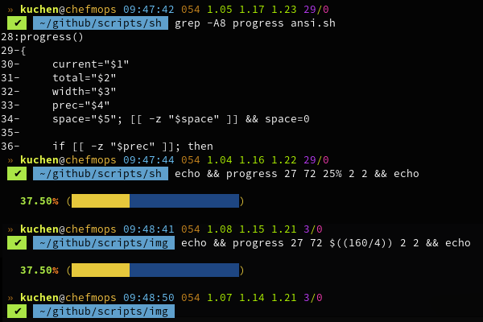
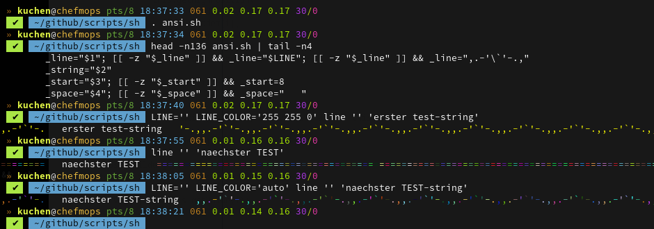

Every Script is made by myself, arose out of necessity.. or because I found it interesting.

> [!NOTE]
> All of these scripts are implemented for the [`bash` shell](https://www.gnu.org/software/bash/) only!

  

### News
* \[**2025-09-16**\] New "sub" script [`phrack-training`.sh](#phracksh), v**0.1.0**;
* \[**2025-09-09**\] New script [`phrack`.sh](#phracksh), v**0.1.0**;
* \[**2025-08-20**\] New script to (better) count fs entries: [`count`.sh](#countsh); v**0.1.1**;
* \[**2025-06-30**\] For a private project I just coded the new [`man2txt`.sh](#man2txtsh), v**0.2.0**;
* \[**2025-06-30**\] Updated the [`ansi`.sh](#ansish), v**1.3.3**;
* \[**2025-05-03**\] TINY helper [`ntpdate`.sh](#ntpdatesh), v**0.3.0**;
* \[**2025-04-21**\] Updated the [`reverse`.sh](#reversesh), v**0.4.2**;
* \[**2025-04-16**\] New lil helper [`quit`.sh](#quitsh), v**0.1.0**;

 

#### TODO
* [ ] [`inc`.sh](#incsh)
* [ ] [`crypto`.sh](#cryptosh)

  

## Index
1. [News](#news)
2. [Scripts](#bash-shell-scripts)
	* [`prompt`.sh](#promptsh)
	* [`dump`.js](#dumpjs)
	* [`lines`.sh](#linessh)
	* [`layout`.sh](#layoutsh)
	* [`fresh`.sh](#freshsh)
	* [`ansi`.sh](#ansish)
	* [`logrotate`.sh](#logrotatesh)
	* [`make-nodejs`.sh](#make-nodejssh)
	* [`unexify`.sh](#unexifysh)
	* [`sync`.sh](#syncsh)
	* [`up2date`.sh](#up2datesh)
	* [`count`.sh](#countsh)
	* [`count-all-lines`.sh](#count-all-linessh)
	* [`copy`.sh](#copysh)
	* [`reverse`.sh](#reversesh)
	* [`create-random-files`.sh](#create-random-filessh)
	* [`download-wiki-dumps`.sh](#download-wiki-dumpssh)
	* [`index`.sh](#indexsh)
	* [`man2txt`.sh](#man2txtsh)
	* [`inc`.sh](#incsh)
	* [`crypto`.sh](#cryptosh)
	* [`quit`.sh](#quitsh)
	* [`replace`.sh](#replacesh)
	* [`toilets`.sh](#toiletssh)
	* [`math`.sh](#mathsh)
	* [`baseutils`.sh](#baseutilssh)
	* [`move-by-ext`.sh](#move-by-extsh)
	* [`find-ext`.sh](#find-extsh)
	* [`insert-header`.sh](#insert-headersh)
	* [`ntpdate`.sh](#ntpdatesh)
	* [`router`.sh](#routersh)
	* [`hfdownloader`.sh](#hfdownloadersh)
	* [`convert-hf-to-gguf`.sh](#convert-hf-to-ggufsh)
	* [`hfget`.sh](#hfgetsh)
	* [`nightlounge`.sh](#nightloungesh)
	* [`phrack{,-training}`.sh](#phracksh)
	* [`lsblk`.sh](#lsblksh)
	* [`cursor`.sh](#cursorsh)
	* [`init-sub-proj`.sh](#init-sub-projsh)
3. [Contact](#contact)
4. [Copyright and License](#copyright-and-license)

   

## [**Bash Shell** Scripts](./src/)

 

### `prompt.sh`

**Moved** to it's [own **repository**](https://github.com/kekse1/prompt/).

  

### `dump.js`

In it's [own **repository**](https://github.com/kekse1/dump.js/).

  

### `lines.sh`

You should put this script into your `/etc/profile.d/` directory,
so the `lines()` function will get `source`d. Then just call it this
way - possible parameters are described on top of this bash shell
script file.

* [Version v**0.4.2**](src/lines.sh) (updated **2025-03-05**)

Simple script you can use with either a file path parameter or the
stdin `-` (if defined at all), to perform one of these actions:

* display the line count of your input
* extract a specific line
* extract an area of lines
* negative numbers counting backwards from the `EOF`

  

### `layout.sh`

* [Version v**0.2.0**](src/layout.sh)

The most important thing for me was to switch between keyboard layouts - easily with a shortcut I've set up in XFCE
(Settings -> Keyboard): calling this script with '-' argument only, to switch between the configured layouts.

So either call it without arguments, so it'll show you the currently used layout. Call it with a concrete layout, to
switch to it directly. Or call it with a single `-`, so it'll switch between the configured layouts (by default, it's
on top: `layouts=("us" "de")`).

  

### `fresh.sh`

* [Version v**0.4.6**](src/fresh.sh) (updated **2025-03-05**)

Helper to quickly update `git` repositories.. really tiny.

> [!TIP]
> Includes a function `keep()` to create `.keep` files in empty directories.
> Useful for `git`, since it won't obey empty directories.

  

### `logrotate.sh`

Simple setup for log line entries.

* [Version v**0.0.4**](src/logrotate.sh) (created **2025-03-31**)

See the `syntax()` help: you can append new log lines to a file, and you
can optionally limit the line count to a specific value.

... **really** simple setup.. :-)

> [!TIP]
> Will, jfyi, allow any character; also non-printable,
> BUT any NEWLINE will be replaced by a semicolon `;`
> (from every `\n` or `\r`).

  

### `make-nodejs.sh`

* [Version v**0.3.13**](src/make-nodejs.sh) (updated **2025-04-10**)

For **amd64** and **arm64** (Termux): a script to build a [Node.js](https://nodejs.org/) version that you define in
the command line, with target path `/opt/node.js/${version}/` plus a **symbolic link** `0` pointing to there: so you
can also manage multiple versions, or just check if the newest installation really works, before removing the old one..
the only thing left to do, _just once_, is to merge the fs structure under the symlink path `/opt/node.js/0` into
the `/usr/` hierarchy.

> [!NOTE]
> Just call it via `make-nodejs.sh 23.9.0` (or `make-nodejs.sh v23.9.0`), e.g.!

> [!NOTE]
> In v**0.3.11** I changed the `$tmdir` variable to be below the `/opt/nodejs/` (target) directory,
> due to my `noexec` option in my `/etc/fstab` for my `/tmp/` (ram disk) directory/mount.

  

### `unexify.sh`

* [Version v**0.1.3**](src/unexify.sh) (updated **2025-03-05**)

Little helper script to recursively remove all headers from images.

The primary intention is to secure **all** images in your web root.
So e.g. when you take photos with your smartphone, they'll no longer
contain the GPS coordinates, etc. ;-)

Call with `-h` or `--help` to get to know a bit more.. the help text is encoded
in a variable on the file's top.

_JFYI_: Dependency is the [**`exiftool`**](https://exiftool.org), which is the
packet `libimage-exiftool-perl` within [**Debian** Linux](https://debian.org/).

  

### `sync.sh`

* [Version v**0.4.6**](src/sync.sh) (updated **2025-03-05**)

Another helping hand which became required since I'm managing some archive on my server,
which needs to be synchronized with an SB stick (using `crontab`, ..).

> [!WARNING]
> PLEASE CHECK the **FIRST BOTH** configuration parts, relatively on top of the file..

_BTW_: My target USB stick is formatted as `ExFAT` file system, so not all linux
file permissions and attributes are supported, and also no symbolic links. So I
decided to disable all these by default. If you want/need them, use the `-l` or
`--linux` cmdline argument. Additionally see `-d` or `--dereference`. **;-)**

> [!TOP]
> As usual, you can also use `-h` or `--help`! **:-D**

  

### `ansi.sh`

It's recommended to copy this file to the `/etc/profile.d/` directory.

* [Version v**1.3.3**](src/ansi.sh) (updated **2025-06-30**)

Now also includes the **`progress()`** function:

Plus some helper functions (beneath the regular style and color functions).

> [!TIP]
> I know it since some months or so, but again I saw here the nifty thing that
> `bash` also supports kinda '**spread syntax**' for function calls!
> Example line: `colors=( 32 64 128 ); fg "${colors[@]}"; echo "colored string!"`

  

### `up2date.sh`

* [Version v**0.2.1**](src/up2date.sh)

Tool for [Gentoo](https://gentoo.org/) Linux, [Debian](https://debian.org/) and [Termux](https://termux.dev/) Linux.
I'm using it to do all steps to keep your packages `up2date`, in just one step!

Also, just copy it to `/etc/profile.d/up2date.sh`

  

### `count.sh`

* [Version v**0.1.1**](src/count.sh) (created **2025-08-20**)

You can copy this file to your '/etc/profile.d/' dir.
It does *not* need to be executable - it's `source`d.

  

### `count-all-lines.sh`

* [Version v**0.3.1**](src/count-all-lines.sh) (updated **2024-02-25**)

Will traverse recursively through all sub directories (of current working directory) using one or more `find -iname`
parameters (especially globs to define file extensions!), and output a list of found ones with their line counts,
sorted ascending, and ending with the line count sum of all line counts.

  

### `copy.sh`

* [Version v**0.1.2**](src/copy.sh) (updated **2024-02-25**)

A little helper to `scp` files, with only the remote file path as argument.

I'm using this to copy backups from my server, most because on errors this
is going to repeat the copy (as long you define in the 'loops' variable).
So just set your server {user,host,port} and copy securely.

BTW: yes, I had an unstable line when I created this.. via mobile phone.

  

### `reverse.sh`

My own solution (instead of using `autossh` or so).

* [Version v**0.4.2**](src/reverse.sh) (updated **2025-04-21**)

Kinda 'watchdog', w/ pause between retries. For some reverse ssh tunnel.
Default configuration opens the port on your remote machine - as a
relay/tunnel to your local servers (without NAT w/ port forwarding).

Use \<Ctrl\>+\<C\> to create a SIGINT signal, which will
stop this script (via `trap`).

Now also multiple routes possible.

  

### `create-random.files.sh`

My [`Norbert`](https://github.com/kekse1/norbert/) needed some random input data,
from a directory I wanted to propagate with some temporary files (of an exactly
defined file size).

* [Version v**1.6.1**](src/create-random-files.sh) (updated **2025-03-05**);

So I created this very tiny tool.

> [!IMPORTANT]
> Dependencies: the **`dd`** utility.

> [!NOTE]
> JFYI: Since v**1.4.0** the 1st, 2nd and 3rd argument can
> also be negative. In this case the absolute values of them
> define their maximum of randomly generated params.

> [!TIP]
> Feel free to extract the **`randomChars()`** and **`random()`** functions
> out of the file and put it into one of your `/etc/profile.d/*.sh`.

  

### `download-wiki-dumps.sh`

Downloads the *latest* wiki dumps. See the '$url' vector.
After downloading, they'll be `bunzip2`d. Implemented
with some checks to be absolutely sure, and also creates
backups, etc. .. jfyi.

* [**moved to my repository `unwiki`**](https://github.com/kekse1/unwiki/)

You may configure the `$url` vector/array on top of the file. It'll hold all the url's
to the **latest** dumps at [**dumps**.wikimedia.org](https://dumps.wikimedia.org/). But
expects the original `.bz2` files (so the script can also extract them).

> [!NOTE]
> Depends on the `wget` and the `bunzip2` utility (but this will also be checked).

> [!TIP]
> Before v**0.1.4** there were only german dumps, now I added the english ones, too.
> Additionally there's now also the [**wikidatawiki**](https://dumps.wikimedia.org/wikidatawiki/).

  

### `index.sh`

* [Version v**0.2.3**](src/index.sh) (updated **2025-04-24**)

Finds file duplicates, or just creates an index with the file hashes..

You define a target directory and an optional depth (defaults to 1,
so only the current directory), and in your target directory there'll
be files with names out of their `sha224sum`, with original extensions.

> [!TIP]
> See also my new [`inc.sh`](#incsh). Both together are better. :-)

  

### `man2txt.sh`

Conversion of all (compressed) linux man pages (/usr/share/man/)
into `text/plain` versions. BUT you need a copy of the whole fs
tree, because original input files are being deleted (so replaced
by the new ones) [see also `$_unlink`, on the top];

Will also create an extra INDEX FILE which lists all pages with
their names, sections and (new target) file path's.

* [Version v**0.2.0**](src/man2txt.sh) (created **2025-06-30**)

> [!NOTE]
> Depends on the `groff` and `col` utilities. Plus my [`ansi.sh`](#ansish)
> bash scripting extension (here, somewhere above).

  

### `inc.sh`

> [!NOTE]
> **STILL pure TODO**!

* [Version v**0.2.2**](src/inc.sh) (updated **2025-04-11**)

Renames a bunch of files in a directory (NOT recursive)
with an increasing number. With some options..

This was necessary for me after sorting out duplicates of
some files w/ my older [`index.sh`](#indexsh).

> [!TIP]
> So also take a look at my older [`index.sh`](#indexsh)!
> Both together are better. :-)

#### Parameters
This is the current state of supported `getopt` parameters:

* **`-h / --help`**
* **`-p / --prefix`**
* **`-s / --suffix`**
* **`-d / --hidden`**
* **`-f / --full`**
* **`-g / --global`**
* **`-v / --preserve`**
* **`-r / --remove`**
* **`-t / --sort`**

  

### `crypto.sh`

Manage **LUKS** encryption via `cryptsetup`.

* [Version v**0.0.6**](src/crypto.sh) (updated **2025-04-16**)

> [!NOTE]
> I just **began** with this script.. currently I'm doing some **preparations** only;
> the (bigger) rest stays **TODO**. ..

  

### `quit.sh`

Kinda (really tiny) "management" of exit and it's codes. ...

* [Version v**0.1.0**](src/quit.sh) (created **2025-04-16**)

> [!NOTE]
> See the comment on top of this script for a detailed introduction
> and my intention to create this 'script'.

  

### `replace.sh`

* [Version v**0.1.3**](src/replace.sh) (updated **2025-04-23**)

Recursive (really!) `sed` (regular expression) replacement in (only real) files.

  

### `toilets.sh`

* [Version v**0.0.2**](src/toilets.sh) (created **2024-03-19**)

Easily compare `toilet` (or `figlet`) outputs for a list of fonts in a file (each line another font).
Command line switches are passed through to the tool itself. Input texts can also be set via command
line, or just wait to get asked via `stdin`.

For many fonts see [this link](http://www.jave.de/figlet/fonts/overview.html); and here are the
websites of [`toilet`](http://caca.zoy.org/wiki/toilet) and [`figlet`](http://www.figlet.org/).

The font archive can be un-zipped in `/usr/share/figlet/` (even for `toilet`), or rather it's
`fonts/` directory itself.

  

### `math.sh`

* [Version v**0.2.6**](src/math.sh) (updated **2025-03-05**)

Functions to be `source`d (so copy to `/etc/profile.d/`) providing conversions for size, and in
the future also some more math related functions.. for now, look at the source to get to know more.

You crender an amount of bytes to `GiB`, etc.. base 1024 and 1000 support,
and direct conversion to a specific target unit, or it'll automatically
detect which suites best:
* ` >> Syntax: bytes <value> [ <base=1024 | <unit> [ <prec=2> ] ]`

  

### `baseutils.sh`

* [Version v**0.4.3**](src/baseutils.sh) (updated **2025-04-10**)

This is just the beginning of more bash functions.

The project began with [`baseutils.org`](https://baseutils.org/), which was planned as regular
code (either C or JavaScript). Some first tools had been finished then.. they were planned for
my `Any/Linux` project (with still much, much TODO).. BUT I began to take over some old functions
from my `/etc/profile.d/` scripts, and now here we are..

Still _much_ **TODO**, but the first functions are declared and I'm going to implement everything soon!

  

### `move-by-ext.sh`

* [Version v**0.0.2**](src/move-by-ext.sh) (updated **2024-02-25**)

Another tiny helper... really nothing special.

  

### `find-ext.sh`

* [Version v**0.2.2**](src/find-ext.sh) (updated **2025-04-10**)

Something similar to the [`move-by-ext`.sh](#move-by-extsh) helper, but here without write operations,
only counting all different extensions available under the current working directory. And it's possible
to limit the `find` recursion depth via optional first argument (needs to be positive integer).

> [!TIP]
> Since newest v**0.2.0** it shows a count for each file extensions (how many times they occure).

  

### `insert-header.sh`

* [Version v**0.2.3**](src/insert-header.sh) (updated **2024-06-25**)

My source code needed my (copyright) header when I published it.
So I created this script, since more than just less files needed
to be updated..

The usage is merely simple, look at the output when calling this
script without parameters!

> [!TIP]
> Use the `-d` or `--delete` parameter to unlink all of this script's
> backup files (`*.BACKUP`, or see the (only) `$BACKUP` variable), and
> use `-r` or `--restore` to restore the original files via backups.

> [!NOTE]
> My **TODO** is to replace the file extension argv-parameters by full
> globs, to be pass-thru directed to the `find` command.

  

### `ntpdate.sh`

Really tiny helper to refresh your time. You could also put it in a cronjob;
with optional `$LOG` for every last update.

* [Version v**0.3.0**](src/ntpdate.sh) (published **2025-05-03**)

Call it with a path parameter for logging only the last update.
Without any parameter, either a configured path (below) will be
used, or none if not configured (then you'll see a direct output).

The `$SERVER` should always be configured (in here)!

You could also put this in your cronjobs (use `crontab -e`);
whereas here's my recommendation to argue w/ e.g. `/var/log/ntpdate.sh.log`.

> [!TIP]
> For [Debian Linux](https://debian.org/): `ntpdate` is in the packet `ntpsec-ntpdate` now.

  

### `router.sh`

* [Version v**0.1.3**](src/router.sh) (updated **2025-03-05**)

Some time ago I needed to setup my computer as a router (using `iptables`).

This was created very quickly, without much features or tests.
Feel free to use it as kinda template; see [this link](https://wiki.gentoo.org/wiki/Home_router) for more.

  

### `hfdownloader.sh`

* [Version v**0.3.1**](src/hfdownloader.sh) (updated **2024-07-29**)

Easily use the [`hfdownloader`](https://github.com/bodaay/HuggingFaceModelDownloader) tool, to download
full models from [Hugging Face](https://huggingface.co/), a community for Large Language Models, etc.

You don't really need this script, since the [`hfdownloader`](https://github.com/bodaay/HuggingFaceModelDownloader)
tool is easy enough; it's rather kinda reminder' for myself..

> [!TIP]
> For some more things about **Artificial Intelligence**, take a look at my private website,
> concretely at the [**`~intelligence`** area](https://kekse.biz/?~intelligence).

  

### `convert-hf-to-gguf.sh`

* [Version v**0.1.1**](src/convert-hf-to-gguf.sh) (updated **2024-07-29**)

> [!IMPORTANT]
> Dependencies: **Python 3** (w/ `pip`) and [`llama.cpp`](https://github.com/ggerganov/llama.cpp/);

This script helps you converting hugging face models (see [**huggingface.co**](https://huggingface.co/))
to **GGUF format `.gguf`**, which is necessary for the transformers I listed
on **my website @ [`~intelligence`](https://kekse.biz/?~intelligence)**.

> [!TIP]
> Preparations:
> `python3 -m venv venv`
> `cd venv`
> `source bin/activate`
> `git clone https://github.com/ggerganov/llama.cpp.git`
> `./bin/python3 ./bin/pip install -r llama.cpp/requirements.txt`
> `./bin/python3 llama.cpp/convert-hf-to-gguf.py -h`

  

### `hfget.sh`

Just a tiny helper, if you don't want to use the [`hfdownloader(.sh)`](#hfdownloadersh).

* [Version v**0.2.0**](src/hfget.sh) (created **2024-08-18**)

Downloads from [**Hugging Face**](https://huggingface.co/) with your
own **Token** (a file) included in the HTTP request header. This
massively increases the speed of your downloads, and it allows you
to access (your) non-public files, and maybe more..

Expects either a URL or a file with a list of URLs as parameter. Depends on `wget`.

  

### `nightlounge.sh`

Downloads a Stream until the `DURATION` is reached (then `wget` will be stopped).
I use this script for my daily download of the 'BigFM Nightlounge' podcast.

* [Version v**0.2.8**](src/nightlounge.sh) (updated **2025-03-05**)

> [!TIP]
> You can add this to your '/etc/crontab'. ;-)

  

### `phrack.sh`

Be another mirror! ...

* [Version v**0.1.0**](src/phrack.sh) (created **2025-09-05**);
* [Version v**0.1.0**](src/phrack-training.sh) (created **2025-09-16**);

.. ich brauchte es fuer das Training meines `Norbert`. Ebenso die "Erweiterung" `phrack-training.sh`..

  

### `lsblk.sh`

* [Version v**0.2.3**](src/lsblk.sh) (updated **2024-10-24**)

The main reason for this script was: my Node.js projects need to handle
whole block devices oder partitions. But I wanted to configure them by
their (PART)UUID, so there'd be no problems when regular '/dev/sdb' or
so change (which can happen, and this is a big problem!).

In Node.js there's no regular way to open devices/partitions by their
(PART)UUID; additionally, I couldn't get the sizes of the partitions
or drives via `fstat*()`..

The second reason was: using bash arrays and a special syntax to split
the `--pairs` output into key/value etc., I wanted to leave myself a
hint for future shell scripts.. and for you! Note, that I marked out
for you where to use `case`, if you'd like to manage the key/value pairs.

> [!TIP]
> There's [**another version**](src/lsblk.2.sh) available as well.. **jfyi**.

  

### `cursor.sh`

Tiniest.. just prints out the current cursor position in your active terminal.

* [Version v**0.0.2**](src/cursor.sh) (updated **2025-03-05**)

The real function `cursor()` is only **seven lines** long.

  

### `init-sub-proj.sh`

* [Version v**0.4.1**](src/init-sub-proj.sh) (updated **2025-04-10**)

I do initialize a sub part of my bigger project with
the help of this script.

See the $COPY file list. And end each item without
slash to only initialize it empty (even though dirs
contain entries in your original project). Symbolic
Links stay exactly the same (so using `readlink`).

  

# Contact

# Copyright and License
The Copyright is [(c) Sebastian Kucharczyk](./COPYRIGHT.txt),
and it's licensed under the [MIT](./LICENSE.txt) (also known as 'X' or 'X11' license).

